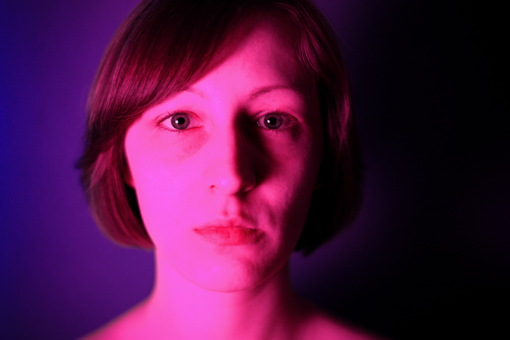

# about

#### I'm a digital media designer, performance artist and musician. 

My projects often address psychological or sociocultural issues and aim to create an immersive experience for the audience. 

 

I studied Elementare Musik at Musikhochschule Münster. 
Currently I'm a student in the Bachelors' Digital Media programm at Hochschule für Künste in Bremen. 

Contact me if you're interested in my work or working together! 

