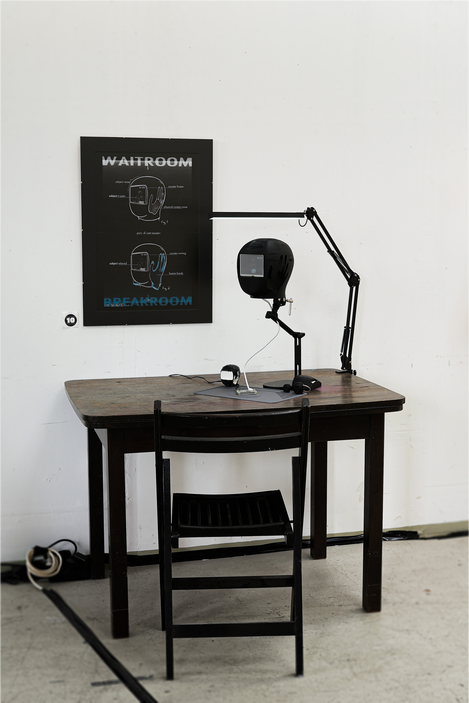
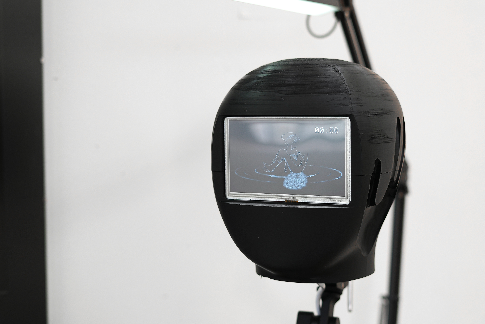
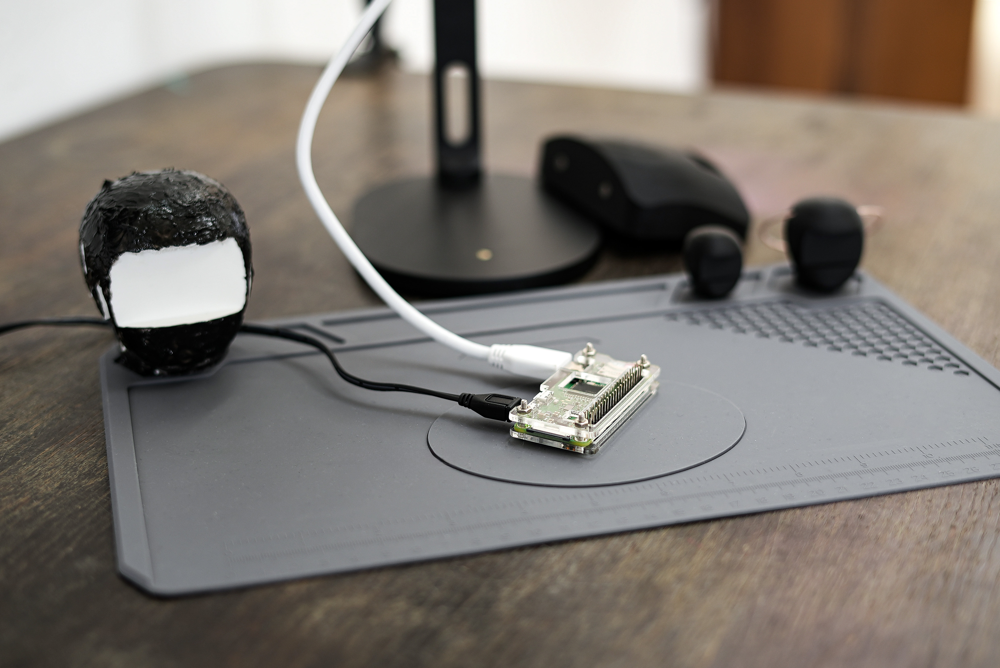
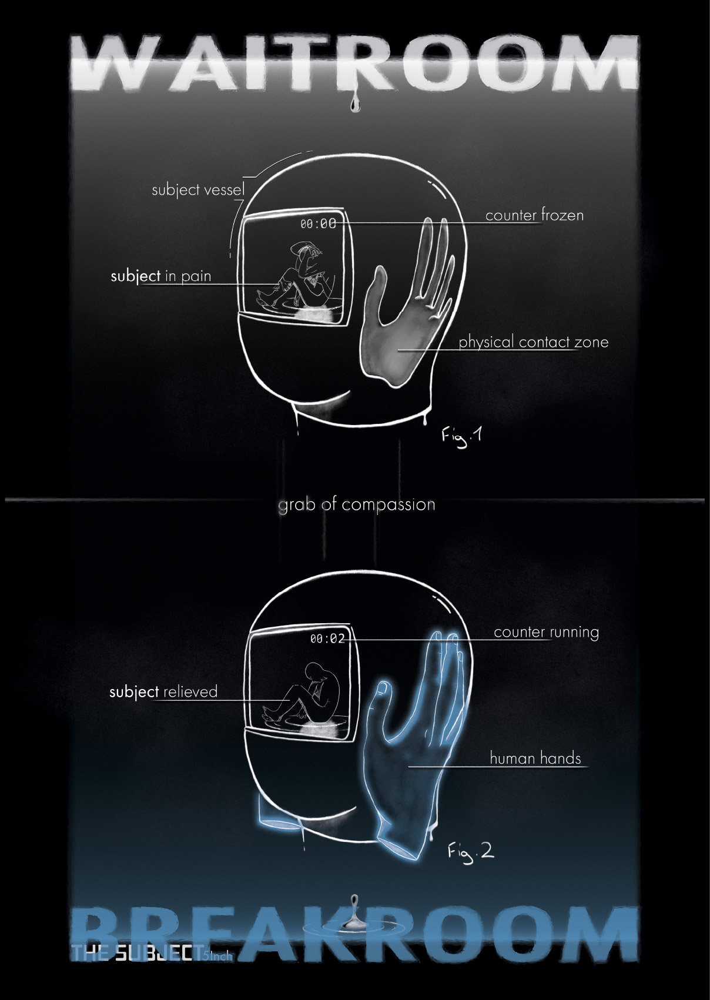

# The Subject

## 2026 
## speculative object

In a possibe world || a social fiction || an unreal reality  
people's everyday lives are accompanied by head-shaped devices called **The Subjects**. 24/7, their screens show human beings in agony, tortured by an unknown entity at an unknown place. 

<figure style="margin: 0">
  
  <figcaption style="font-size: 1rem; margin-top: 0.25rem;"><em>Return Of the Gizmos</em> &nbsp; exhibition at <em>Tor 26</em>, Bremen 2026</figcaption>
</figure>

As long as human hands remain in contact with *The Subject*, the captured human being is released from the pain. A timer counts down the seconds of the torture break, known as the “breakroom”. As soon as the physical contact stops, the torture resumes. 

    

The design and staging of this device are central to the project. The installation consists of the object itself, which is placed on a table and secured by a clamp attached to a stand. The loose cable hanging from the structure, the Raspberry Pi lying on a soldering mat, and the three miniature models of the object reinforce the installation's presentation as a speculative concept model. In the subjects' fictional world, this could be the workplace where the device is being developed. A drawing illustrates the object's functionality.

 

The project explores speculative perspectives on a dystopian, socially engineered society. It asks questions about empathy ('feeling *as* another') and compassion ('feeling *for* another'), and considers how these concepts could be used and misused in a socially engineered world. 
By engaging with the scene in which the object is the key element, viewers are encouraged to imagine an alternative reality and rethink societal conditions and social dilemmas. 

***when nobody’s there, they scream in solitude***
